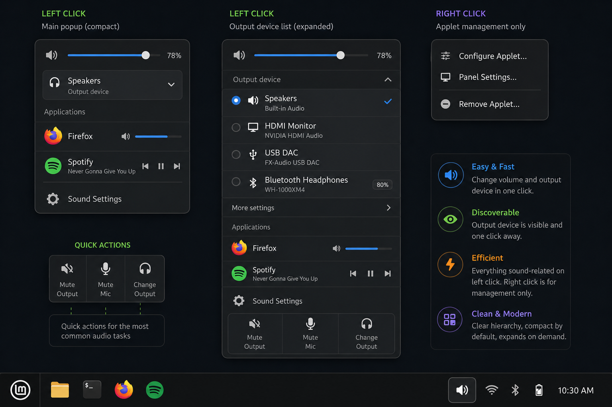

# Cinnamon Modern Sound Applet

A modern Cinnamon panel sound applet — compact by default, expandable when needed.



## Concept

### Left click — main popup

**Compact (default)**

- Master volume slider with percentage (e.g. 78%)
- Output device row (current device + chevron to expand)
- **Applications** section — per-app volume and media controls
  - Simple apps: icon + mini slider (e.g. Firefox)
  - Media players: track title + prev / play-pause / next (e.g. Spotify)
- **Sound Settings** — menu item above quick actions
- **Quick actions** row: Mute Sound · Mute Mic · Open Settings

**Expanded (output device list)**

- Radio list of output devices with icons and subtitles
  - Built-in speakers, HDMI, USB DAC, Bluetooth (with battery %)
- **Sound Settings** — menu item above quick actions
- **Quick actions** row: Mute Sound · Mute Mic · Open Settings

### Right click — applet management

Standard Cinnamon context menu only:

- Configure Applet…
- Panel Settings…
- Remove Applet…

Sound controls stay on left click; right click is for panel/applet management.

### Design principles

- **Hierarchy** — global volume → device → per-app controls
- **Compact by default** — device list expands on demand
- **One-click access** — common tasks without opening system settings

## Project structure

```
modern-sound@husain-anabtawi.com/
├── applet.js              # Main applet logic
├── widgets/               # Custom menu widgets
│   ├── volume.js
│   ├── deviceDisplay.js
│   ├── masterVolumeItem.js
│   ├── outputDeviceItem.js
│   └── quickActionsItem.js
├── metadata.json          # Applet identity (required)
├── settings-schema.json   # Configurable settings
└── stylesheet.css         # Theming (dark, blue accents)
docs/
└── concept.png            # UI mockup
tests/
├── mocks/cinnamon.js      # Offline Cinnamon API mocks
└── run-tests-node.js      # Unit/smoke tests (via ./test.sh)
```

## Install (development)

```bash
mkdir -p ~/.local/share/cinnamon/applets
ln -sfn "$(pwd)/modern-sound@husain-anabtawi.com" ~/.local/share/cinnamon/applets/modern-sound@husain-anabtawi.com
```

Restart Cinnamon: `Alt+F2` → `r` → Enter, then add **Modern Sound** from Applets settings.

## Test before reload

Run offline tests (syntax + mocked Cinnamon runtime) without reloading the panel:

```bash
./test.sh
```

This checks JS syntax, JSON schemas, and smoke-tests widgets/applet logic with mocked `imports.ui` / `imports.gi` APIs. If all tests pass, it is safe to restart Cinnamon.

Optional: install `gjs` (`sudo apt install gjs`) to run the same tests under GJS instead of Node.

## Debug

Logs: `~/.xsession-errors`, `~/.cinnamon/glass.log`

## Implementation status (block by block)

| Block | Status |
|-------|--------|
| Master volume slider + percentage | Done |
| Quick actions (Mute Sound · Mute Mic · Open Settings) | Done |
| Output device picker | Done |
| Applications / per-app volume (incl. media controls) | Planned |
| Sound Settings link | Planned |
