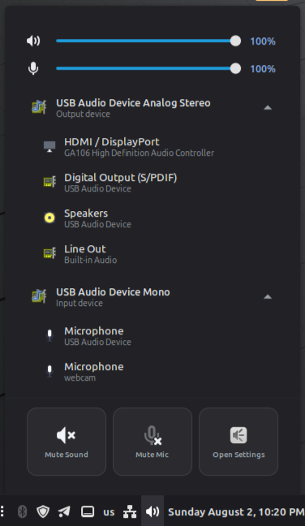

# Cinnamon Modern Sound Applet

A modern Cinnamon panel sound applet — compact by default, expandable when needed.



## Concept

### Left click — main popup

**Compact (default)**

- Master volume slider with percentage (e.g. 78%)
- Mic volume slider with percentage
- Output device row (current device + chevron to expand)
- Input device row (current device + chevron to expand)
- **Applications** section — per-app volume and media controls
  - Simple apps: icon + mini slider (e.g. Firefox)
  - Media players: track title + prev / play-pause / next (e.g. Spotify)
- **Quick actions** row: Mute Sound · Mute Mic · Open Settings (opens Sound Settings)

**Expanded (device lists)**

- Radio list of output devices with icons and subtitles
  - Built-in speakers, HDMI, USB DAC, Bluetooth (with battery %)
- Radio list of input devices with icons and subtitles
  - Built-in microphone, USB mic, headset, Bluetooth
- **Quick actions** row: Mute Sound · Mute Mic · Open Settings (opens Sound Settings)

### Right click — applet management

Standard Cinnamon context menu only:

- Configure Applet…
- Panel Settings…
- Remove Applet…

Sound controls stay on left click; right click is for panel/applet management.

### Scroll wheel — panel icon

Scroll up or down on the sound icon in the panel to raise or lower master volume (5% per step), matching the behavior of the default Cinnamon sound applet.

### Design principles

- **Hierarchy** — global volume → device → per-app controls
- **Compact by default** — device list expands on demand
- **One-click access** — common tasks without opening system settings

## Project structure

```
modern-sound@husain-anabtawi.com/
├── applet.js              # Main applet logic
├── handlers/              # Panel icon event handlers
│   └── on-icon-scroll-handler.js
├── utils/                 # Shared helpers
│   ├── device-icon-resolver.js
│   ├── volume-icon-resolver.js
│   └── volume-math.js
├── widgets/               # Custom menu widgets
│   ├── stream-volume-item.js
│   ├── device-picker-item.js
│   ├── app-display.js
│   ├── app-stream-item.js
│   ├── applications-item.js
│   └── quick-actions-item.js
├── metadata.json          # Applet identity (required)
├── settings-schema.json   # Configurable settings
└── stylesheet.css         # Theming (dark, blue accents)
docs/
├── screenshot.png         # Actual applet UI
└── concept.png            # UI mockup
tests/
├── mocks/cinnamon.js      # Offline Cinnamon API mocks
└── run-tests-node.js      # Unit/smoke tests (via ./test.sh)
```

## Install

**Official (recommended)** — from Cinnamon:

1. Open **Menu → Preferences → Applets**
2. Go to **Download**
3. Search for **Modern Sound** and install
4. Add it to your panel

## Development (optional)

Link this repo into your applet folder for live editing:

```bash
./dev-link.sh
```

Run tests and reload Cinnamon:

```bash
./reload.sh   # tests only when using the Spices copy
./dev-link.sh # then reload after code changes
```

Switch back to the Spices-installed copy:

```bash
./dev-unlink.sh
```

Then re-download or update **Modern Sound** from Applets → Download if needed.

## Test before reload

Run offline tests (syntax + mocked Cinnamon runtime) without reloading the panel:

```bash
./test.sh
```

This checks JS syntax, JSON schemas, and smoke-tests widgets/applet logic with mocked `imports.ui` / `imports.gi` APIs. If all tests pass, it is safe to restart Cinnamon.

Optional: install `gjs` (`sudo apt install gjs`) to run the same tests under GJS instead of Node.

## Debug

Logs: `~/.xsession-errors`, `~/.cinnamon/glass.log`
